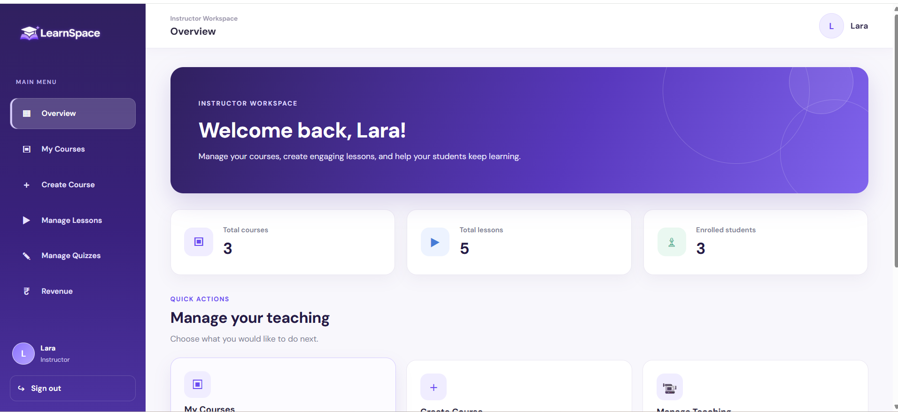

# LearnSpace LMS

### A Full-Stack Learning Management System

LearnSpace LMS is a web-based Learning Management System designed to simplify online education. It provides separate role-based dashboards for Students, Instructors, and Administrators to manage courses, lessons, enrollments, payments, and learning activities through a centralized platform.

## Live Demo

- **Frontend:** https://learn-space-lms-five.vercel.app/
- **Backend:** https://learnspace-lms.onrender.com/

> Note: The backend is hosted on Render's free plan and may take some time to respond after a period of inactivity.

## Features

### Student
- Student registration and login
- Browse available courses
- Enroll in courses
- Demo payment checkout for paid courses
- Successful and failed payment handling
- Access enrolled course lessons
- Track learning progress
- View live classes
- My Learning dashboard

### Instructor
- Instructor dashboard
- Create, update, and manage courses
- Add and manage course lessons
- Manage live classes
- View enrolled student counts
- Track course revenue
- View payment and revenue information

### Admin
- Admin dashboard
- Manage students and instructors
- Manage courses and platform activities
- Monitor platform information

## Project Screenshots

### Student Dashboard


### Instructor Dashboard


### Admin Dashboard


## Technologies Used

**Frontend**
- React.js
- HTML5
- CSS3
- JavaScript
- Vite

**Backend**
- Node.js
- Express.js
- REST APIs

**Database**
- MongoDB
- Mongoose

**Tools**
- Visual Studio Code
- Git and GitHub

**Deployment**
- Vercel – Frontend
- Render – Backend
- MongoDB Atlas – Database

## Project Structure

```text
LearnSpace-LMS/
├── client/                 # React frontend
├── server/                 # Node.js backend
└── README.md
```

## Installation and Setup

### 1. Clone the repository

```bash
git clone https://github.com/mishrasakshi10/LearnSpace-LMS.git
cd LearnSpace-LMS
```

### 2. Install backend dependencies

```bash
cd server
npm install
```

Create a `.env` file inside the `server` directory:

```env
PORT=5000
MONGODB_URI=your_mongodb_connection_string
JWT_SECRET=your_jwt_secret
CLIENT_URL=http://localhost:5173
```

Add any additional environment variables required by your configured features. Never upload actual credentials or secret keys to GitHub.

### 3. Start the backend

```bash
npm start
```

The backend runs at:

`http://localhost:5000`

### 4. Install frontend dependencies

Open another terminal:

```bash
cd client
npm install
```

Create a `.env` file inside the `client` directory:

```env
VITE_API_URL=http://localhost:5000/api
```

### 5. Start the frontend

```bash
npm run dev
```

Open the local frontend URL shown in the terminal, usually:

`http://localhost:5173`

## Payment Information

The project currently uses a demo payment checkout flow for testing payment success and failure scenarios. It does not process real payments through a live payment gateway.

## Future Enhancements

- Advanced learning analytics
- Course ratings and reviews
- Enhanced live learning features
- Improved learning progress reports

## Author

**Sakshi Mishra**

B.Sc. Information Technology Graduate

GitHub: [@mishrasakshi10](https://github.com/mishrasakshi10)

---

*LearnSpace LMS – Making online learning more accessible and organized.*